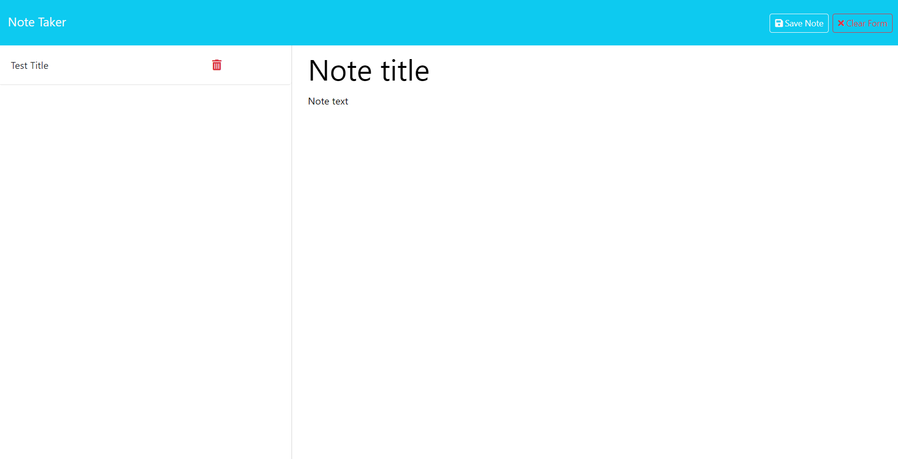

# note-taker

## Project Description
This project was to help me learn how to use a back-end server as a database. I learned how to use Express to handle HTTP methods in an API route using GET and POST requessts. I also learned how to deploy my application to Heroku so that the database and server are always accessible.

## Table of Contents
[Installation](#installation)  
[Usage](#usage)  
[Screenshot](#screenshot)  
[Live Application](#live-application)  
[Source Code](#source-code)  
[Questions](#questions)  

## Installation
This repository can either be cloned or downloaded as a ZIP file.

## Usage
To get started, click the "Get Started" button. Then, a list of previously added notes will be displayed (if any). To add a note, fill in a title and text then click the "Save Form" button. If a saved note is being displayed, click the "New Note" button in the top right to create a new note.

## Screenshot

## Live Application
https://fast-eyrie-19094-4b72de3e83ab.herokuapp.com

## Source Code
https://github.com/coldnebraska/note-taker

## Questions
Github: https://github.com/coldnebraska 